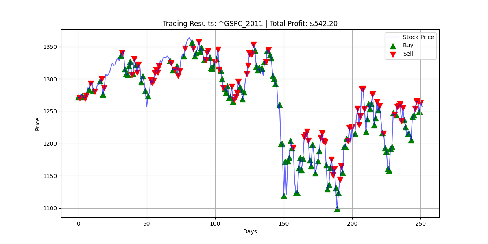

# Q-Trader 2026 (Modernized)

A State-of-the-Art 2026 implementation of Reinforcement Learning applied to stock trading. This project utilizes a **Transformer-based PPO** (Proximal Policy Optimization) agent built with **Stable Baselines3** and a custom **Gymnasium** environment.

The model uses n-day windows of normalized price changes to determine the optimal action (Buy, Sell, or Sit) using a Transformer Encoder as a feature extractor to capture complex temporal dependencies.

## Key Features (2026 Upgrade)
- **Architecture:** PyTorch Transformer Encoder for sequence feature extraction.
- **RL Algorithm:** Proximal Policy Optimization (PPO) via Stable Baselines3.
- **Environment:** Standardized Gymnasium `StockTradingEnv`.
- **Modern Stack:** Python 3.12+, Pandas for data handling, and SB3 for robust RL.

## Results (2026 Modernized)

After 200 episodes of training on the S&P 500 (^GSPC), the Transformer-based PPO agent achieved the following results on the 2011 test set:


**S&P 500, 2011. Profit of $542.20.**

The plot shows the agent's strategic Buy (Green) and Sell (Red) points, successfully capturing market trends using its self-attention mechanism.

## Running the Code

Ensure you are using the correct virtual environment.

### Training
To train the model:
```bash
python train.py [stock_symbol] [window_size] [episodes]
```
Example:
```bash
python train.py ^GSPC 10 100
```
This will save a model named `ppo_transformer_[stock_symbol]` in the `models/` directory.

### Evaluation
To evaluate a trained model on a test set:
```bash
python evaluate.py [stock_symbol] [model_name]
```
Example:
```bash
python evaluate.py ^GSPC_2011 ppo_transformer_^GSPC
```

## Data
Stock data should be placed in the `data/` directory as CSV files (standard Yahoo Finance format).

## Implementation Details
- **Observation Space:** A sequence of price change sigmoids over an n-day window.
- **Action Space:** Discrete (0: Sit, 1: Buy, 2: Sell).
- **Reward Function:** Realized profit from closed trades.
